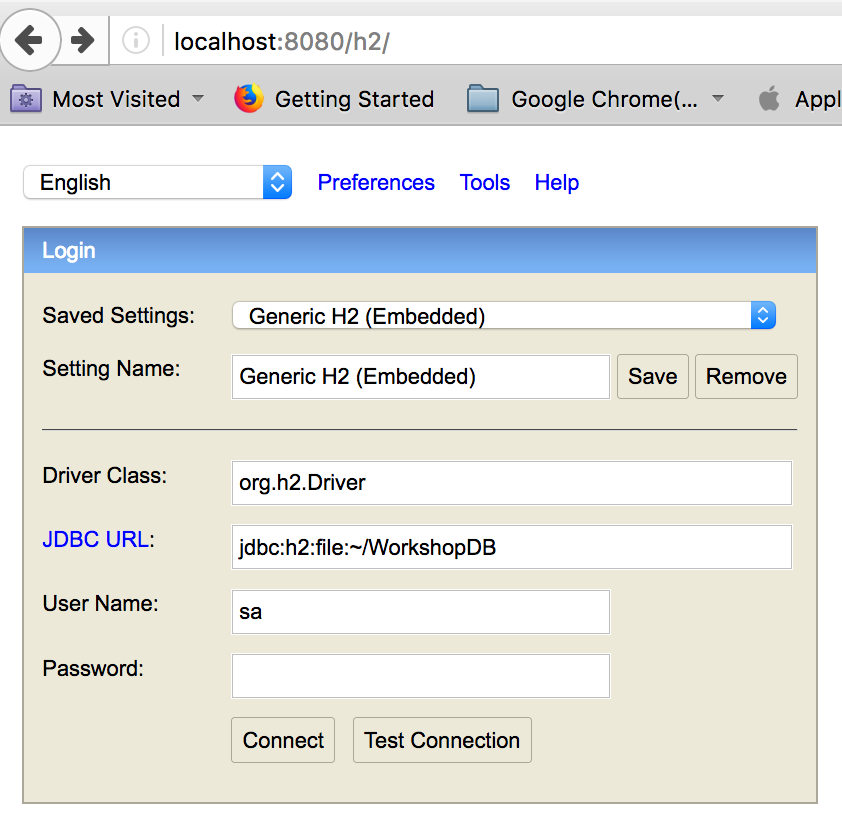
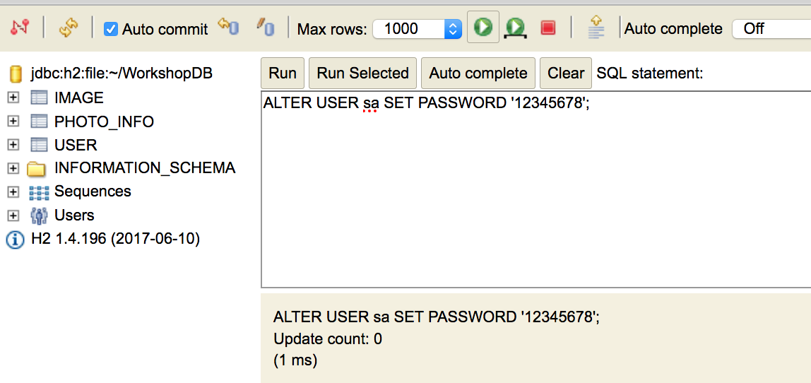

## 1. Module-01 :  Web application - Building a first web application with Spring Boot (time duration : 30 mins)
- This is a simple web application using Spring Boot and MySQL
- Check module-01 application and run this application to check the application structure and it's execution.


### 1. First application

#### 1.1 Download workshop codes

##### 1. Download source codes 
- Eclipse user : in your workspace directory
- Cloud9 user : in your environment directory

```
git clone https://github.com/aws-asean-builders/aws-java-spring-dev-workshop
```


#### 1.2 Compile and packaging

##### 1. Compile and packaging with Maven

	1. Change working directory to module-01
	
```
cd <work_space>/module-01
```

	2. Compile and package without unit testing(recommended)

```
mvn compile package -Dmaven.test.skip=true

```
	
##### 2. Run your application 
	
```
java -jar target/module-01-0.1.0.jar
```

#### 1.3  Test your application
Run MainControllerTest with JUnit Runner and check the console output and it's result. if you get a error messages then take a look at how to fix the problem.
We have 2 kinds of unit test, one is mock test, the other is integration test, please check 2 files in test folder.


##### 1. Test app using 'curl' for API
Launch your application in your Eclipse IDE and run 'curl' command like below

```

# test user
curl 'localhost:8080/workshop/users/all'

curl 'localhost:8080/workshop/users/add?name=First&email=ex1@gmail.com'

curl 'localhost:8080/workshop/users/deleteall'

curl 'localhost:8080/workshop/users/all'

# test image
curl 'localhost:8080/workshop/images/all'

curl 'localhost:8080/workshop/images/add?userid=1&bucket=seon-singapore&prefix=/output&filename=test.PNG'

curl 'localhost:8080/workshop/images/deleteall'

curl 'localhost:8080/workshop/images/all'

```

##### 2. Check web page
- localhost:8080/index.html
- Run CRUD for User data
- see user list, add/update/delete user

- localhost:8080/users/add
- localhost:8080/users


#### 1.4 Change H2 password
- Currently we are using H2 database. If you want to change this database to MySQL in local then, please see application.properties

	1. Connect H2 console (http://localhost:8080/h2)
	2. Specify JDBC URL "jdbc:h2:file:~/WorkshopDB"
	3. User Name : sa
	4. Password :  <none>



5. Change password to "12345678"

```
ALTER USER sa SET PASSWORD '12345678';
```



#### 1.4 Change application.properties

Please see application.properties in **moudle-01/src/main/resources**

1. Specify password value

``` 
spring.datasource.password=12345678
```
2. Re-launch application

```
mvn compile package -Dmaven.test.skip=true

java -jar target/module-01-0.1.0.jar

```


### 3. Take a look at application structure

##### 1. Check the structure of application
- Check **application.properties** and **spring.factories** in META-INF of resource folder. This file is for **CustomConfigListner.java** to change the environment configuration using Configuration Listner
- Check package structure, boot, controller, model, repository
- UserRepository is for the JPA 
- Check the **pom.xml**, it contains Spring Boot, JPA, MySQL, Thymeleaf

```
  <dependency>
    <groupId>org.springframework.boot</groupId>
    <artifactId>spring-boot-starter-data-jpa</artifactId>
  </dependency>    
  <dependency>
    <groupId>org.springframework.boot</groupId>
    <artifactId>spring-boot-starter-web</artifactId>
  </dependency>
  <dependency>
    <groupId>org.springframework.boot</groupId>
    <artifactId>spring-boot-starter-test</artifactId>
    <scope>test</scope>
  </dependency>
  <!-- thymeleaf-->  
  <dependency>
    <groupId>org.springframework.boot</groupId>
    <artifactId>spring-boot-starter-thymeleaf</artifactId>
  </dependency>     
  <dependency>
    <groupId>org.webjars</groupId>
    <artifactId>bootstrap</artifactId>
    <version>3.3.7-1</version>
  </dependency>			    		     
  <!-- Use MySQL Connector -->
  <dependency>
    <groupId>mysql</groupId>
    <artifactId>mysql-connector-java</artifactId>
  </dependency> 
 ```

##### 2. Prevent "JABXExeption" errors

- If you get a error related to "JABXExeption", then add following content in your pom.xml

```
<!-- add JAX-B to prevent No Class Found : JABXExeption -->
<dependency>
    <groupId>javax.xml.bind</groupId>
    <artifactId>jaxb-api</artifactId>
    <version>2.2.11</version>
</dependency>
<dependency>
    <groupId>com.sun.xml.bind</groupId>
    <artifactId>jaxb-core</artifactId>
    <version>2.2.11</version>
</dependency>
<dependency>
    <groupId>com.sun.xml.bind</groupId>
    <artifactId>jaxb-impl</artifactId>
    <version>2.2.11</version>
</dependency>    		
```


### 4. Appedix. 
If you have errors like this "jaxb-core-2.2.11.jar; ZipFile invalid LOC header ", when you try to mvn compilation or packaging, 
then 
**Remove your maven repository <your_home>/.m2/repository** 
and rebuild your project

create a Spring Boot project from scratch
Please check this blog for creating a spring boot project from scratch using Maven. 
[add later]

	 
