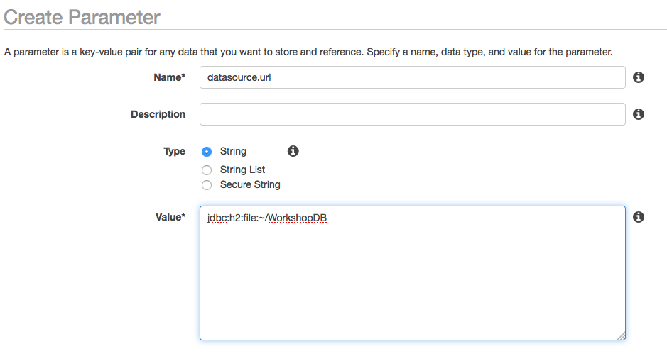

## Module-02 : First use of AWS service(Parameter Store) and it's integration (time duration : 40 mins)
- This module introduce you to how to configure CustomListner for retrieving environment parameters from Parameter Store in AWS System Manager. 
- There are many environment paramenters in Spring Data applications, for example, database connection URL, database user name, password or AWS access key and secret key, and there are described in application.properties, generally. the more secured way to retrieve these information is required. 
- Start from moudle-01 and complete the codes with below information.
- module-02 is a starting points to use AWS services with AWS Java SDK.

- Create a parameters in ParameterStore on AWS


 
## If you start from module-02 (from completed source code)

### 0. Run application

```
cd module-02

mvn compile package -Dmaven.test.skip=true

java -jar target/module-02-0.1.0.jar

```

 
- **You definitely got error above, it is because you don't have Parameter Stores**
- You need to create this following step 2

1. Configure Your Parameter Store
2. Check your EC2 roles (If you have errors after creating parameters in Parameter Store, then check it)
 
### 1. Externalize Configuration 


#### 1.1. Configure AWS CLI to allow application to get access key and secret key 
**If you configured AWS CLI configuraiton before, then skip this 1.1 

```
> aws configure
> AWS Access Key ID [None]: [your key]
> AWS Secret Access Key [None]: [your key]
> AWS region : [your region]
```

#### 1.2. Configure ParameterStore in System Manager 
- AWS Systems Manager Parameter Store provides secure, hierarchical storage for configuration data management and secrets management. You can store data such as passwords, database strings, and license codes as parameter values.
Complete the following tasks to configure application parameters for ParameterStore (select your region, for example, us-east-1, ap-southeast-1 and so forth)


1. Open the System Manager Cosole and go to Parameter Store
2. Create parameters in ParameterStore for database URL, database username and password in your region
3. Specify **datasource.url** as **jdbc:h2:file:~/WorkshopDB**
4. Specify **datasource.username** as **sa**
5. Specify **datasource.password** as **12345678**



#### 1.3. Rerun and check it

- Check your EC2 role, if you have errors after creating parameters in Parameter Store.


### 2. Expose Application Metrics and Information
We are using "spring-boot-starter-actuator", please check application metrics and information using following command

```
curl localhost:8080/heath
curl localhost:8080/beans
```

<hr>
<hr>
<hr>

## If you start from previous module-01 (not completed source code), then you need to change your source code 
<hr>

### 2. Externalize Configuration using ParameterStores

Reference :

https://stackoverflow.com/questions/29072628/how-to-override-spring-boot-application-properties-programmatically)

https://stackoverflow.com/questions/33072452/log-configurationproperties-in-springboot-prior-to-startup)
	
	
#### 2.1. Add packages in pom.xml

```
  <dependencyManagement>
    <dependencies>
      <dependency>
        <groupId>com.amazonaws</groupId>
        <artifactId>aws-java-sdk-bom</artifactId>
        <version>1.11.289</version>
        <type>pom</type>
        <scope>import</scope>
      </dependency>
    </dependencies>
  </dependencyManagement>    
    
  <!-- AWS SDK System Manager -->  
  <dependency>
    <groupId>com.amazonaws</groupId>
    <artifactId>aws-java-sdk-ssm</artifactId>
  </dependency> 
         
```


#### 2.2. Configuration properties and Java class

	1. Create CustomConfigListner.java in hello package

```
package hello;

import java.util.Properties;

import org.springframework.boot.context.event.ApplicationEnvironmentPreparedEvent;
import org.springframework.context.ApplicationListener;
import org.springframework.core.env.ConfigurableEnvironment;
import org.springframework.core.env.PropertiesPropertySource;

import com.amazonaws.services.simplesystemsmanagement.AWSSimpleSystemsManagement;
import com.amazonaws.services.simplesystemsmanagement.AWSSimpleSystemsManagementClientBuilder;
import com.amazonaws.services.simplesystemsmanagement.model.GetParameterRequest;
import com.amazonaws.services.simplesystemsmanagement.model.GetParameterResult;


public class CustomConfigListner implements ApplicationListener<ApplicationEnvironmentPreparedEvent> {
	
	
	// DO !! overide this method with your Parameter Store, refer ParameterStoreTest.java and 
	@Override
	public void onApplicationEvent(ApplicationEnvironmentPreparedEvent event) {
		AWSSimpleSystemsManagement client = AWSSimpleSystemsManagementClientBuilder.defaultClient();
		GetParameterRequest parameterRequest = new GetParameterRequest();
		parameterRequest.withName("datasource.url").setWithDecryption(Boolean.valueOf(true));
		GetParameterResult parameterResult = client.getParameter(parameterRequest);
		String url = parameterResult.getParameter().getValue();

		parameterRequest.withName("datasource.username").setWithDecryption(Boolean.valueOf(true));
		parameterResult = client.getParameter(parameterRequest);
		String username = parameterResult.getParameter().getValue();	
		
		parameterRequest.withName("datasource.password").setWithDecryption(Boolean.valueOf(true));
		parameterResult = client.getParameter(parameterRequest);
		String password = parameterResult.getParameter().getValue();
//		String version = parameterResult.getParameter().getVersion().toString();
		
    ConfigurableEnvironment environment = event.getEnvironment();
    Properties props = new Properties();
    props.put("spring.datasource.url", url);
    props.put("spring.datasource.username", username);
    props.put("spring.datasource.password", password);
    environment.getPropertySources().addFirst(new PropertiesPropertySource("myProps", props));
    
    System.out.println("##### url = " + url);
    System.out.println("##### username = " + username);
    System.out.println("##### password = " + password);	
	 }
	
}

```


#### 2.3. Check availability of parameters in Parameter Store
	1. Create ParameterStoreTest.java in ser/test/java
	2. Add below codes
	
```
	package hello;


import org.junit.Test;
import org.junit.runner.RunWith;
import static org.junit.Assert.assertEquals;
import org.springframework.boot.test.context.SpringBootTest;
import org.springframework.test.context.junit4.SpringRunner;


import com.amazonaws.services.simplesystemsmanagement.AWSSimpleSystemsManagement;
import com.amazonaws.services.simplesystemsmanagement.AWSSimpleSystemsManagementClientBuilder;
import com.amazonaws.services.simplesystemsmanagement.model.GetParameterRequest;
import com.amazonaws.services.simplesystemsmanagement.model.GetParameterResult;


@RunWith(SpringRunner.class)
@SpringBootTest
public class ParameterStoreTest {
	@Test
    public void testGetParamenterFromStore() {
			AWSSimpleSystemsManagement client = AWSSimpleSystemsManagementClientBuilder.defaultClient();
			GetParameterRequest parameterRequest = new GetParameterRequest();
			parameterRequest.withName("datasource.password").setWithDecryption(Boolean.valueOf(true));
			GetParameterResult parameterResult = client.getParameter(parameterRequest);
			String password = parameterResult.getParameter().getValue();
			String version = parameterResult.getParameter().getVersion().toString();
			assertEquals(password, "12345678");
			assertEquals(version, "1");		
    }

}

```

	3. Run ParameterStoreTest.java

### 3. Run your application

##### 1. Run your application 
	
```
mvn package -Dmaven.test.skip=true

java -jar target/module-02-0.1.0.jar

```


	2. Run application and check a below ULR
	
```
http://localhost:8080/beans 

http://localhost:8080/env

http://localhost:8080/health 

http://localhost:8080/metrics 

http://localhost:8080/trace

http://localhost:8080/mappings	
	
```

### 4. Actuator

reference:
https://www.devglan.com/spring-boot/spring-boot-actuator-rest-endpoints-example
https://www.devglan.com/spring-security/spring-boot-security-custom-form-login-example
https://docs.spring.io/spring-boot/docs/current/reference/html/production-ready-endpoints.html

1. Add a following dependecy in pom.xml

```
			<dependency>
				<groupId>org.springframework.boot</groupId>
				<artifactId>spring-boot-starter-actuator</artifactId>
			</dependency>
```

2. Specify following properties (if spring 1.5x)

```
endpoints.actuator.enabled=true
management.security.enabled=false

```

3. Specify following properties (if spring 2.x)

```
endpoints.actuator.enabled=true
management.endpoints.web.exposure.include=*
management.endpoints.web.exposure.exclude=env
```

if you include "spring-boot-starter-security" then, it is not possible to call each endpoints.


