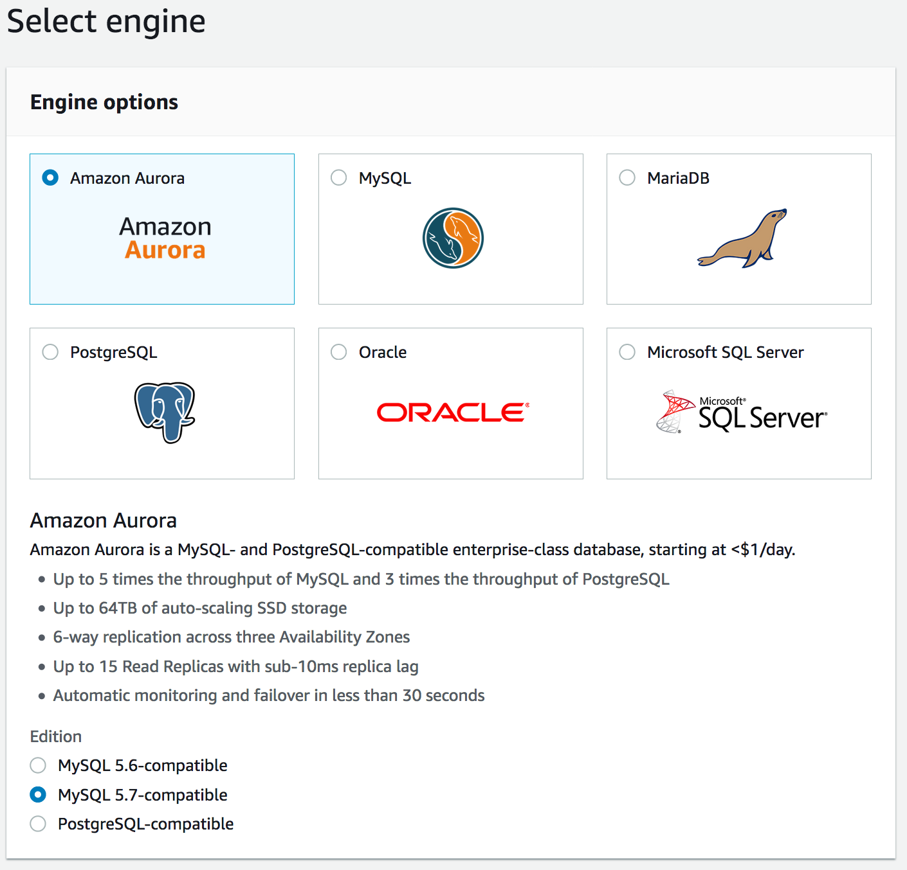
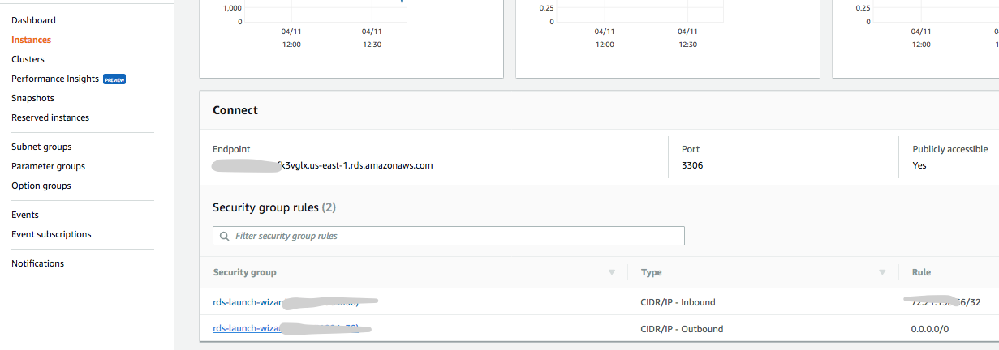
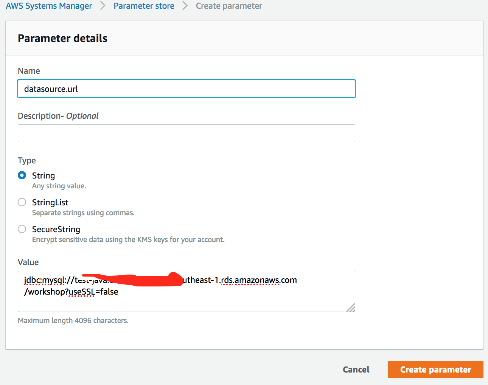

## Module 3 : Using AWS services (time duration : 50 mins)
From this module, we are beginning to develop application using AWS services.
We will complete the following tasks.
- Change database from Mysql to Aurora for Mysql 
- Resize a file and save it to local folder
- Upload a file to S3 using AWS SDK
- Retrieve information from picture using Amazon Rekognition and Translate text using Amazon Translate


### References
Please refer the following information to complete the tasks
[Develop S3](https://docs.aws.amazon.com/sdk-for-java/v1/developer-guide/examples-s3-objects.html#upload-object)
[Develop Rekognition](https://docs.aws.amazon.com/rekognition/latest/dg/get-started-exercise.html)
[Develop Translate](https://docs.aws.amazon.com/translate/latest/dg/examples-java.html)


## If you start from module-03 (from completed source code)

### 1. Run application and test


	1. Run your application

```
cd module-03

mvn compile package -Dmaven.test.skip=true

java -jar target/module-03-0.1.0.jar

```

	2. Run Unit Test
	
- Run **AWSAWServicesTest** in **hello.logics** of src/test/java


- **You definitely got error above, it is because you don't have Parameter Stores**
- You need to create this following step 4

1. Create a Aurora MySQL instance 
2. Set up MySQL : creating table, user
3. Change parameters in parameter values


### 2. Change database to Aurora for MySql 

#### 2.1. Create Aurora MySQL

	1. Open the Amazon RDS console : https://console.aws.amazon.com/rds/home?region=us-east-1#
	2. Select Aurora for MySQL 5.7 Database engine and select the 
	3. Create a DB instance configuring database name, username, password.
	4. Remember your master username and password to perform next step
	



	5. Create database in configuration page (for example, workshop)
	
Name your Aurora database as TSA-Workshop, and keep the rest of the values as default.
- Select db instances of your choice (e.g. db.t2.micro)
- Keep the default multi-AZ
- Cluster name: TSA-Workshop-Cluster
- Database name: workshop
- Make sure that the database is publicly accessible.
- Keep everything else as default and then launch the Aurora database.
- At your left panel, click on the 'instances' menu. You should see that RDS is creating two database instances for you (one reader and writer role respectively).

	6. Wait until completing the creation of Aurora for MySQL 

Endpoint looks like this - "tsa-workshop.ctdltt3xxxx.us-east-1.rds.amazonaws.com"
	
	7. Check Endpoint and Security Group
	

	
	8. Change Security Group configuration, if you need.
	9. Check connectivity from your local computer (if you don't have any MySQL client, please install it)


```
brew install mysql

mysql -h <endpoint of your instance> -u <master username> -p
```
	
	10. Create user and it's privilege using following SQL commands(use MySQL client in your computer)

```
mysql> create user 'demouser'@'%' identified by '12345678'; -- Creates the user
mysql> grant all on workshop.* to 'demouser'@'%'; -- Gives all the privileges to the new user on the newly created 
```

	12. Check the tables, there is no table yet.

```
show tables;

```
	13. You can use GUI tool for MySQL (for example, DBVisualizer)
	
	


#### 2.2. Configure ParameterStore in System Manager 

AWS Systems Manager Parameter Store provides secure, hierarchical storage for configuration data management and secrets management. You can store data such as passwords, database strings, and license codes as parameter values.
Complete the following tasks to configure application parameters for ParameterStore (default region is us-east-1)

	1. Open the Amazon EC2 console at https://console.aws.amazon.com/ec2/
	2. Change values in ParameterStore for database URL, database username and password

1. datasource.url = jdbc:mysql://<your_db_endpoint>/workshop?&useSSL=false
2. datasource.username = demouser
3.	 datasource.password = 12345678
	


	3. Add datasource.url, datasource.username, datasource.password for your Aurora instance. 
	   Specify values as you configured in previous steps.
	


#### 2.3 Run your application (Not changed Yet)
After running, check tables of workshop database 

```
user workshop;

show tables;

select * from User;

```

<hr>
<hr>
<hr>

## If you start from previous module-02 (not completed source code), then you need to change your source code 
<hr>

### 3. Implement logics

#### 3.1 Basic structure to use AWS services
	1. Declare a client for the services to call
	2. Initialize a client with various information

for example

```

AmazonTranslate translate = AmazonTranslateClientBuilder
	.standard()
	.withRegion(region)   // set region
	.withCredentials(new AWSStaticCredentialsProvider(credentials)) //set credentials
	.build();

```

#### 3.2 Complete a logics

	1. Create package "hello.logics"
	2. Create AWSAIServices.java
	
```
package hello.logics;

import com.amazonaws.services.rekognition.AmazonRekognition;
import com.amazonaws.services.rekognition.AmazonRekognitionClientBuilder;
import com.amazonaws.AmazonClientException;
import com.amazonaws.auth.AWSCredentials;
import com.amazonaws.auth.AWSStaticCredentialsProvider;
import com.amazonaws.auth.profile.ProfileCredentialsProvider;
import com.amazonaws.regions.Regions;
import com.amazonaws.services.rekognition.model.AmazonRekognitionException;
import com.amazonaws.services.rekognition.model.DetectLabelsRequest;
import com.amazonaws.services.rekognition.model.DetectLabelsResult;
import com.amazonaws.services.rekognition.model.Image;
import com.amazonaws.services.rekognition.model.Label;
import com.amazonaws.services.rekognition.model.S3Object;
import com.amazonaws.services.translate.AmazonTranslate;
import com.amazonaws.services.translate.AmazonTranslateClientBuilder;
import com.amazonaws.services.translate.model.TranslateTextRequest;
import com.amazonaws.services.translate.model.TranslateTextResult;
import java.util.List;

public class AWSAIServices {
	
    AWSCredentials credentials;
    
    public AWSAIServices()
    {
	    try {
	        credentials = new ProfileCredentialsProvider("default").getCredentials();
	    } catch(Exception e) {
	       throw new AmazonClientException("Cannot load the credentials from the credential profiles file. "
	        + "Please make sure that your credentials file is at the correct "
	        + "location (/Users/userid/.aws/credentials), and is in a valid format.", e);
	    }
    }
    
	public List<Label> retrieveInformation(String bucket, String photoPath, Regions region)
	{
		List<Label> labels = null;
		
	    AmazonRekognition rekognitionClient = AmazonRekognitionClientBuilder
	  	         .standard()
	  	         .withRegion(region)
	  	         .withCredentials(new AWSStaticCredentialsProvider(credentials))
	  	         .build();
	
	    DetectLabelsRequest request = new DetectLabelsRequest()
	  		  .withImage(new Image()
	  		  .withS3Object(new S3Object()
	  		  .withName(photoPath).withBucket(bucket)))
	  		  .withMaxLabels(10)
	  		  .withMinConfidence(75F);
	
	    try {
	       DetectLabelsResult result = rekognitionClient.detectLabels(request);
	       labels = result.getLabels();

	    } catch(AmazonRekognitionException e) {
	       e.printStackTrace();
	    }
	    return labels;
	}
	
	public String translate(String text, String sourceLangCode, String targetLangCode, Regions region)
	{
	    
	    AmazonTranslate translate = AmazonTranslateClientBuilder
	    					.standard()
	    		       .withRegion(region)
	    	         .withCredentials(new AWSStaticCredentialsProvider(credentials))
	    	         .build();
	
	    TranslateTextRequest request = new TranslateTextRequest()
	            .withText(text)
	            .withSourceLanguageCode(sourceLangCode)
	            .withTargetLanguageCode(targetLangCode);
	    TranslateTextResult result  = translate.translateText(request);
//	    System.out.println("### translated = " + result.getTranslatedText());
	    return result.getTranslatedText();
	}
}


```

	3. Create ResizeImage.java

```
package hello.logics;

import java.awt.Graphics2D;
import java.awt.Image;
import java.awt.image.BufferedImage;
import java.io.File;
import java.io.IOException;

import javax.imageio.ImageIO;

public class ResizeImage {
	
	private BufferedImage orgImage;
	private BufferedImage resizedImage;
	
    public void readFile(String filepath) throws IOException {
        File input = new File(filepath);
        orgImage = ImageIO.read(input);
    }
    
    public void writeFile(String filepath, String formatName) throws IOException{
        File output = new File(filepath);
        ImageIO.write(resizedImage, formatName, output);
    }

    public void resize(int height, int width) {
        Image tmp = orgImage.getScaledInstance(width, height, Image.SCALE_SMOOTH);
        resizedImage = new BufferedImage(width, height, BufferedImage.TYPE_INT_ARGB);
        Graphics2D g2d = resizedImage.createGraphics();
        g2d.drawImage(tmp, 0, 0, null);
        g2d.dispose();
    }
    
    public BufferedImage getOrgImage()
    {
    		return orgImage;
    }  
    
    public BufferedImage getResizedImage() 
    {
    		return resizedImage;
    }
    
}


```

	4. CreateS3FileTransfer.java
	
```
package hello.logics;

import java.io.File;
import java.util.List;
import com.amazonaws.services.s3.AmazonS3ClientBuilder;
import com.amazonaws.services.s3.AmazonS3;
import com.amazonaws.services.s3.model.AmazonS3Exception;
import com.amazonaws.services.s3.model.Bucket;
import com.amazonaws.regions.Regions;

public class S3FileTransfer {
	
	public boolean checkBucket(String bucket, Regions region) {
		final AmazonS3 s3 = AmazonS3ClientBuilder.standard().withRegion(region).build();
		if (s3.doesBucketExistV2(bucket)) {return true;
		} else {
			//create a bucket
			 try {
	        Bucket b = s3.createBucket(bucket);
	    } catch (AmazonS3Exception e) {
	        System.err.println(e.getErrorMessage());
	        return false; //error
	    }
		}
		return true;
	}
	
	public void put(String bucket, String key, File file, Regions region)
	{

	}
	
	public List<String> list(String prefix, Regions region) 
	{
		return null;
		 
	}
	
}


```

#### 3.3. Test a service (see module-03)
- Check and run unit test code  

	1. Run MySQLTest.java
		This is an example code for DynamoDB
	2. Run AWSAIServicesTest.java, ResizeImageTest.java, S3FileTransferTest.java
	3. Check codes
	
	
	
