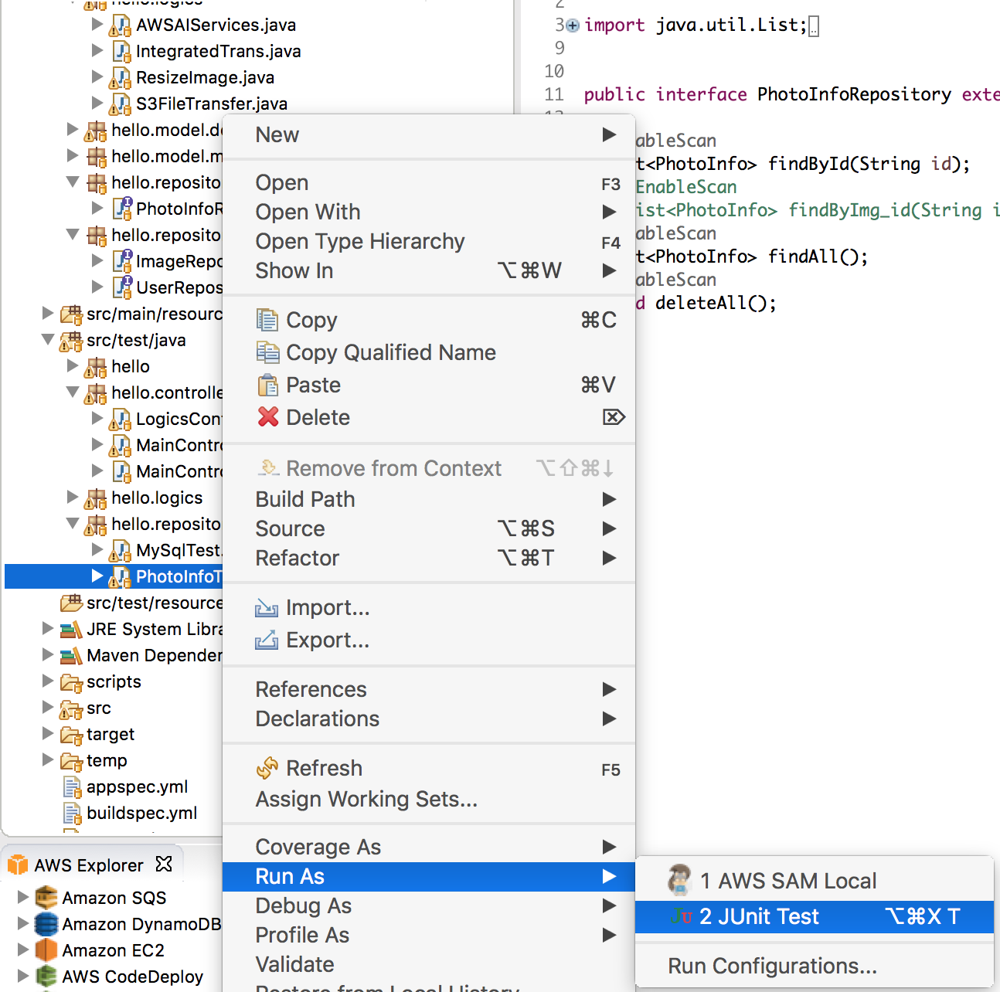
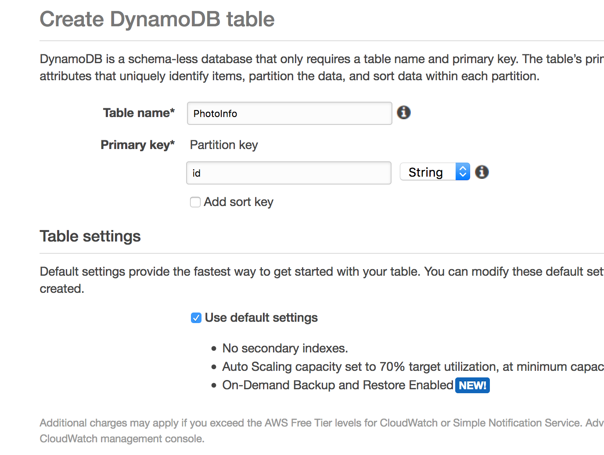

## Module-04 : Using multiple repositories using Spring Data (time durations : 30 mins)
In this module, we will learn how to configure the multiple repositories of Aurora and DynamoDB using Spring Data.
- Create a table in DynamoDB 
- Create configuration files for DynamoDB and MySQL DB. 
- Create Model classes for each database (User for MySQL, PhotoInfo for DynamoDB)
- Create a model, repository packages and change Model and Repository package path to distinguish it in two repositories 
- Change application.properties
- Test 2 repositories with Unit Test codes


## If you start from module-04 (from completed source code)

### 1. Run application and test


#### 1.1  Run your applcation

```
cd module-04

mvn compile package -Dmaven.test.skip=true

java -jar target/module-04 -0.1.0.jar

```

#### 1.2 Curl
- bucket=your bucket name
- prefix= your file prefix (for exmple, images/a.jpg)
- region = your region

```
curl 'localhost:8080/workshop/trans/integrated?bucket=<your_bucket>&prefix=<prefix>&region=<region>'
```


#### 1.3 Run Unit Test
	
- Run **PhotoInfoTest** in **hello.repository** of src/test/java



- **You definitely got error above, it is because you don't have Parameter Stores**
- You need to create this following steps


### 1.4. Create DynamoDB table
	1. Create a "PhotoInfo" table
	2. Specify "id" as a primary partition key



<hr>
<hr>
<hr>

## If you start from previous module-02 (not completed source code), then you need to change your source code 
<hr>

### 2. Update source codes

#### 2.1. Add Spring Data for Database

- We are going to use Spring Data for DynamoDB 

- reference : [derjust's Github](https://github.com/derjust/spring-data-dynamodb)

- Add it to Pom.xml

```
  <!-- spring-data-dynamo-db -->
  <dependency>
      <groupId>com.github.derjust</groupId>
      <artifactId>spring-data-dynamodb</artifactId>
      <version>4.5.0</version>
  </dependency> 
		    
```

#### 2.2. Implement DB configuration classes
- Reference : [dynamodb put item request](https://github.com/aws-samples/aws-dynamodb-examples/blob/master/src/main/java/com/amazonaws/codesamples/lowlevel/LowLevelItemCRUDExample.java)

- We need to create configuration class for MySQL and DynamoDB to use each repository

	1. Create package "hello.config"
	2. Create a new class, MysqlDBConfig.java
	
```
@Configuration
@EnableTransactionManagement
@EnableJpaRepositories(
		entityManagerFactoryRef = "mysqlEntityManager", 
		transactionManagerRef = "mysqlTransactionManager", 
		basePackages = "hello.repository.mysql"
)
public class MysqlDBConfig {
	
	@Autowired
	public ConfigurableEnvironment environment;
	
	/**
	 * MySQL datasource definition.
	 * 
	 * @return datasource.
	 */
	@Bean
	@ConfigurationProperties(prefix = "spring.mysql.datasource")
	public DataSource mysqlDataSource() {
		System.out.println("##### DataSource called");
		DataSource ds = DataSourceBuilder.create().build();
		System.out.println("##### DataSource url = " + environment.getProperty("spring.mysql.datasource.url").toString());
		return ds ;
	}
 
	/**
	 * Entity manager definition. 
	 *  
	 * @param builder an EntityManagerFactoryBuilder.
	 * @return LocalContainerEntityManagerFactoryBean.
	 */
	@Bean(name = "mysqlEntityManager")
	public LocalContainerEntityManagerFactoryBean mysqlEntityManagerFactory(EntityManagerFactoryBuilder builder) {
		return builder
					.dataSource(mysqlDataSource())
					.properties(hibernateProperties())
					.packages(User.class)
					.persistenceUnit("mysqlPU")
					.build();
	}
 
	/**
	 * @param entityManagerFactory
	 * @return
	 */
	@Bean(name = "mysqlTransactionManager")
	public PlatformTransactionManager mysqlTransactionManager(@Qualifier("mysqlEntityManager") EntityManagerFactory entityManagerFactory) {
		return new JpaTransactionManager(entityManagerFactory);
	}
 
	private Map<String, Object> hibernateProperties() {
 
		Resource resource = new ClassPathResource("hibernate.properties");
		try {
			Properties properties = PropertiesLoaderUtils.loadProperties(resource);
			return properties.entrySet().stream()
											.collect(Collectors.toMap(
														e -> e.getKey().toString(),
														e -> e.getValue())
													);
		} catch (IOException e) {
			return new HashMap<String, Object>();
		}
	}

```

	3. Create a new class, DynamoDBConfig.java
	
```
package hello.config;

import com.amazonaws.services.dynamodbv2.AmazonDynamoDB;
import com.amazonaws.services.dynamodbv2.AmazonDynamoDBClientBuilder;


import org.socialsignin.spring.data.dynamodb.repository.config.EnableDynamoDBRepositories;
import org.springframework.beans.factory.annotation.Value;
import org.springframework.context.annotation.Bean;
import org.springframework.context.annotation.Configuration;

@Configuration
@EnableDynamoDBRepositories(basePackages = "hello.repository.ddb")
public class DynamoDBConfig {

	  @Value("${amazon.dynamodb.endpoint}")
	  private String amazonDynamoDBEndpoint;
	
	  @Value("${amazon.aws.accesskey}")
	  private String amazonAWSAccessKey;
	
	  @Value("${amazon.aws.secretkey}")
	  private String amazonAWSSecretKey;

    @Bean
    public AmazonDynamoDB amazonDynamoDB() {
        AmazonDynamoDB amazonDynamoDB = AmazonDynamoDBClientBuilder.standard()
           .build();
        return amazonDynamoDB;
    }

}


```

	4. Change "spring.datasource" properties to "spring.mysql.datasource" in CustomConfigListner.java

```
ConfigurableEnvironment environment = event.getEnvironment();
Properties props = new Properties();
props.put("spring.mysql.jpa.hibernate.ddl-auto", "update");
props.put("spring.mysql.datasource.url", url);
props.put("spring.mysql.datasource.username", username);
props.put("spring.mysql.datasource.password", password);
props.put("spring.mysql.datasource.driver-class-name", "com.mysql.jdbc.Driver");
environment.getPropertySources().addFirst(new PropertiesPropertySource("myProps", props));

```

#### 2.3. Separate Model classes into individual package

hello.model.mysql.User
hello.model.ddb.PhotoInfo

#### 2.4. Change application.properties

You just keep value as "key" and "key2" in this file. No need to specify your reall key here (**IMPORTANT!**).

```
#AWS Keys
amazon.dynamodb.endpoint=endpoint
amazon.aws.accesskey=key
amazon.aws.secretkey=key2

```
**WARNING :** *Never expose your real key in your code.*


#### 2.4 Test running application

```
# test image
curl 'localhost:8080/workshop/photos/all'

curl 'localhost:8080/workshop/photos/add?img_id=1&locale=en&img_info=hahahahahah+hehe'

curl 'localhost:8080/workshop/photos/deleteall'

curl 'localhost:8080/workshop/images/all'


```


### 3. Create a test code
Create PhotoInfoTest in hello.repository(test)

```
@Autowired
PhotoInfoRepository repository;

@Test
public void sampleTestCase() {
  repository.deleteAll();
  PhotoInfo p = new PhotoInfo("a.jpeg", "hello", "hallo");	
  repository.save(p);
  
  List<PhotoInfo> result2 = (List<PhotoInfo>) repository.findAll(); 
  
  assertTrue("Not empty", result2.size() > 0);
}
```