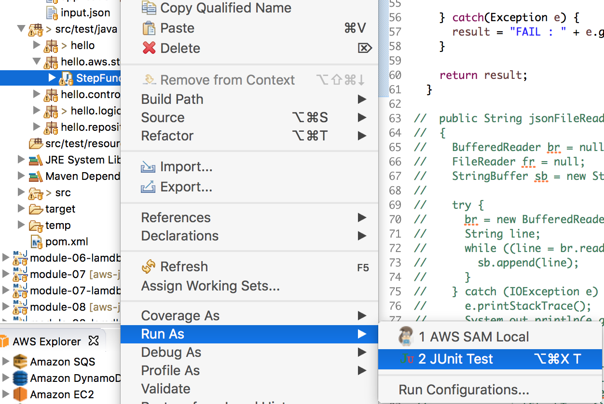
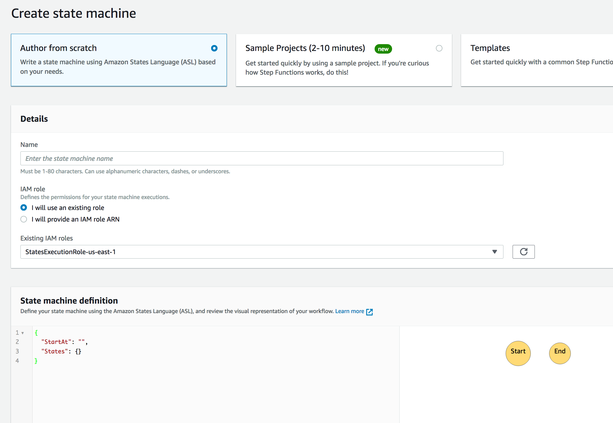

## module-06 : Create StepFunction and use a Stepfucntion in your application (20 mins)
- Create a Stepfunction 
- Integrate Lambda Functions with a StepFunction

##### Reference

[Create a Step function](https://docs.aws.amazon.com/step-functions/latest/dg/tutorial-lambda-state-machine-cloudformation.html)
[Call a StepFunction] (https://aws.amazon.com/blogs/developer/stepfunctions-fluent-api/)

## If you start from module-06 (from completed source code)


### 1. Run application

```
mvn compile package -Dmaven.test.skip=true

java -jar target/module-06-0.1.0.jar

```

### 2. Run unit Test and Curl

### 2.1 Run StepFunctionTest.java in **hello.aws.stepfunction in src/testjava**



### 2.2 Curl
- bucket=your bucket name
- prefix= your file prefix (for exmple, images/a.jpg)


```
curl 'localhost:8080/workshop/trans/integrated?bucket=<your_bucket>&prefix=<prefix>&region=<region>'
```


- **You definitely got error above 2.1 and 2.2, it is because you don't have Lambda functions**
- You need to create this following step 2

### 3.  Create a StepFunction using JSON

#### 3. 1. Change a step-function.json in *main/resources/aws*

- Change a resource value


```
{
  "Comment" : "Machine learning execution with spot instance",
  "StartAt" : "RetrieveInfoFromPhotoUsingRekognition",
  "States"  : {
    "RetrieveInfoFromPhotoUsingRekognition": {
      "Type"      : "Task",
      "Resource"  : "arn:aws:lambda:us-east-1:550622896891:function:MyFunction-workshop-rekognition",
      "Retry" : [ {"ErrorEquals":["HandledError"], "MaxAttempts":3} ],
      "Next"      : "TransInfoUsingTranlate"
    }, 
    "TransInfoUsingTranlate": {
      "Type"      : "Task",
      "Resource"  : "arn:aws:lambda:us-east-1:550622896891:function:MyFunction-workshop-translate",
      "Next"      : "StoreTransDataIntoDynamoDB"
    },
    "StoreTransDataIntoDynamoDB": {
      "Type"      : "Task",
      "Resource"  : "arn:aws:lambda:us-east-1:550622896891:function:MyFunction-workshop-dynamodb",    
      "Retry" : [ {"ErrorEquals":["HandledError"], "MaxAttempts":3} ],
      "End": true
  		}
  	}
}

```

#### 3.2. Change a input file in same folder (step-input.json)

- change a bucket, prefix, sourceLangCode, targetLangCode

```
{
  "bucket":"seon-virginia-2016", 
  "prefix":"images/a.jpeg",
  "text" : "Hello, hello",
  "translated" : "",
  "sourceLangCode" :"en",
  "targetLangCode" : "es"
}
```

#### 3.3 Create a StepFunction in your console



<hr>
<hr>
<hr>

## If you start from previous module (not completed source code)
<hr>


### 1. Create a StepFunction

### 1.1 Change event class of Lambda for StepFunction 


Create a common Model class (StepEventInput, StepEventOutout)

StepEventInput.java (omit getter/setter)

```
	private String id;
	private String bucket;
	private String prefix;
	private String text;
	private String translated;
	private String sourceLangCode;
	private String targetLangCode;
```

StepEventOutput.java (omit getter/setter)

```
	private String text;
	private String error_message;
```
	
 
#### 1.2 Create a StepFunction using JSON

##### 1. Create a step-function.json in *main/resources/aws*

```
{
  "Comment" : "Machine learning execution with spot instance",
  "StartAt" : "RetrieveInfoFromPhotoUsingRekognition",
  "States"  : {
    "RetrieveInfoFromPhotoUsingRekognition": {
      "Type"      : "Task",
      "Resource"  : "arn:aws:lambda:us-east-1:550622896891:function:MyFunction-workshop-rekognition",
      "Retry" : [ {"ErrorEquals":["HandledError"], "MaxAttempts":3} ],
      "Next"      : "TransInfoUsingTranlate"
    }, 
    "TransInfoUsingTranlate": {
      "Type"      : "Task",
      "Resource"  : "arn:aws:lambda:us-east-1:550622896891:function:MyFunction-workshop-translate",
      "Next"      : "StoreTransDataIntoDynamoDB"
    },
    "StoreTransDataIntoDynamoDB": {
      "Type"      : "Task",
      "Resource"  : "arn:aws:lambda:us-east-1:550622896891:function:MyFunction-workshop-dynamodb",    
      "Retry" : [ {"ErrorEquals":["HandledError"], "MaxAttempts":3} ],
      "End": true
  		}
  	}
}

```

##### 2. Create a input file in same folder (step-input.json)

```
{
  "bucket":"seon-virginia-2016", 
  "prefix":"images/a.jpeg",
  "text" : "Hello, hello",
  "translated" : "",
  "sourceLangCode" :"en",
  "targetLangCode" : "es"
}
```

#### 1.3 Implement a test code

##### 1. Create StepFunctionTest in *hello.aws.stepfunction*

```
final AWSStepFunctions stepFunctionclient = AWSStepFunctionsClientBuilder.defaultClient();

URL inputFile = Application.class.getResource("/aws/step-input.json");
String input = jsonFileRead(inputFile);
StartExecutionRequest startExecutionRequest 
= new StartExecutionRequest()
.withInput(input)
.withStateMachineArn("arn:aws:states:us-east-1:5591:stateMachine:workshop-stepfunction").withSdkRequestTimeout(30000);

StartExecutionResult executionResult = stepFunctionclient.startExecution(startExecutionRequest);
```
Test a code and check the result.