## Module-09 Dockerization and CI/CD

In this module, we introduce the fundamental concept of CodeStar and how to build a quick CI/CD pipeline with CodeStar. You will be provided with hands-on on migrating your project to CodeStar project you created and how to build docker environment for your application
- Create a docker for your application and deploy through CI/CD
- Create a CodeBuilder for Java compilation and Dockerization
- Push docker image to ECR
- Getting a docker from ECR and check it's availability on local machine
- Complete a CICD for dockerization and deployment to ECS


### 1. Create a docker for this application.


#### 1.1 Create your first local docker 

refer : 
https://docs.aws.amazon.com/AmazonECS/latest/developerguide/docker-basics.html#docker-basics-create-image

- You need to install docker in your local server

##### 1. Run your first docker application

	1. Check a Dockerfile

```
FROM openjdk:8-jdk-alpine
VOLUME /tmp
ARG JAR_FILE
COPY ${JAR_FILE} app.jar
ENTRYPOINT ["java","-Djava.security.egd=file:/dev/./urandom","-jar","/app.jar"]
```
	2. Create a docker image
	
```	
	docker build -t hello-world . --build-arg JAR_FILE="./target/<YOUR_ARTIFACT_FILE>"
```

	3. Run docker in your local machine
	
```
	docker run -p 8080:8080 -it hello-world bash
```

	4. Check the application in your console
	
	5. Change a host port for 80
	
```
	docker run -p 80:8080 -it hello-world bash
```

##### 2. More commands for docker

	1. run docker as a daemon
```
	docker run -d -p 80:8080 --name=test-1 hello-world 
	
	docker build -t hello-world . --build-arg JAR_FILE="<YOUR_ARTIFACT_FILE>"
	
```
	2. Check running docker and stop it

```
	docker ps

	docker stop <CONTAINER ID>
```

	3. Remove all container

```
#stop all running docker
	docker stop $(docker ps -a -q)
# Delete all containers
docker rm $(docker ps -a -q)
# Delete all images
docker rmi $(docker images -q)
```

#### 1.2 Create a ECR repository

	1. Run a following AWS CLI command

```
	aws ecr create-repository --repository-name java-workshop	
	
```
	2. Check response and save a repository ARN

```
{
    "repository": {
        "registryId": "550622896891", 
        "repositoryName": "java-workshop	", 
        "repositoryArn": "arn:aws:ecr:ap-southeast-1:<account id>:repository/java-workshop	", 
        "createdAt": 1516947869.0, 
        "repositoryUri": "<account id>.dkr.ecr.ap-southeast-1.amazonaws.com/java-workshop	"
    }
}

```

#### 1.3 Configure CodeCommit and Git credentials

##### 1. Create a CodeCommit repository
 
 Refer : 
  https://docs.aws.amazon.com/codecommit/latest/userguide/setting-up.html#setting-up-standard
 
	1. create a repository in CodeCommit

```
 aws codecommit create-repository --repository-name java-workshop-docker --region <YOUR REGION>    
```

	2. Download your CodeCommeit credentials from IAM
	
	3. Create a credentials

```
git config --global credential.helper '!aws codecommit credential-helper $@'
git config --global credential.UseHttpPath true

      
```

##### 2. if you have any problems on pushing (MacOS only)

**Easy solution !!**
- **Delete all codecommit keychains**

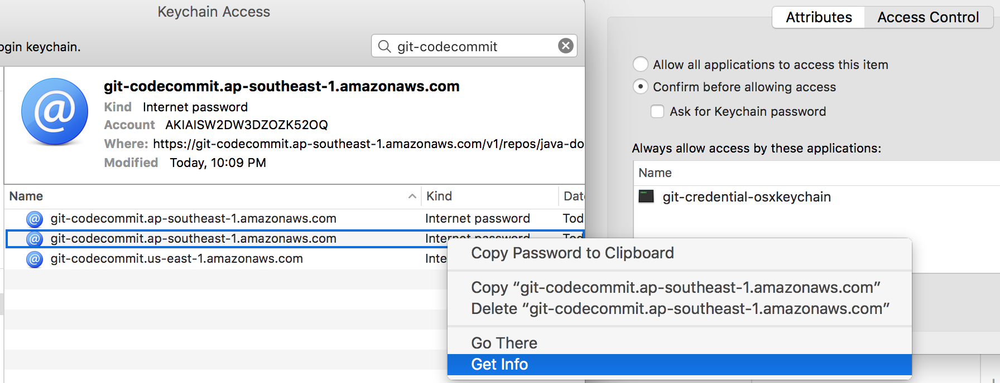  

refer : https://docs.aws.amazon.com/codecommit/latest/userguide/setting-up-https-unixes.html

If you are using macOS, use HTTPS to connect to an AWS CodeCommit repository. After you connect to an AWS CodeCommit repository with HTTPS for the first time, subsequent access will fail after about fifteen minutes. The default Git version on macOS uses the Keychain Access utility to store credentials. For security measures, the password generated for access to your AWS CodeCommit repository is temporary, so the credentials stored in the keychain will stop working after about 15 minutes. To prevent these expired credentials from being used, you must either:


    1. Install a version of Git that does not use the keychain by default.
    2. Configure the Keychain Access utility to not provide credentials for AWS CodeCommit repositories.
    3. Open the Keychain Access utility. (You can use Finder to locate it.)
    4. Search for git-codecommit.us-east-2.amazonaws.com. Highlight the row, open the context menu or right-click it, and then choose Get Info.
    5. Choose the Access Control tab.
    6. In Confirm before allowing access, choose git-credential-osxkeychain, and then choose the minus sign to remove it from the list.
    7. Note
    	After removing git-credential-osxkeychain from the list, you will see a pop-up dialog whenever you run a Git command. Choose Deny to continue. If you find the pop-ups too disruptive, here are some alternate options:
        Connect to AWS CodeCommit using SSH instead of HTTPS. For more information, see For SSH Connections on Linux, macOS, or Unix.
        In the Keychain Access utility, on the Access Control tab for git-codecommit.us-east-2.amazonaws.com, choose the Allow all applications to access this item (access to this item is not restricted) option. This will prevent the pop-ups, but the credentials will eventually expire (on average, this takes about 15 minutes) and you will see a 403 error message. When this happens, you must delete the keychain item in order to restore functionality.


### 2 Create a builder project for project and a docker image

refer : https://docs.aws.amazon.com/codebuild/latest/userguide/sample-docker.html
	
- There is 2 builder json file. create-dock-builder.json and create-java-builder.json	
- create-java-builder.json is a file for creating CodeBuild for compiling and packaging Java source code to JAR output file.
- create-dock-builder.json is a file for creating CodeBuild for creating docker images 
	
#### 2.1. Change Builder files

	1. Change the values accoriding to your environments
	2. CodeCommit URL, region-ID, account-ID,Amazon-ECR-repo-name and role-name ARN

```
{
  "name": "sample-docker-project",
  "source": {
    "type": "CODECOMMIT",
    "location": "<YOUR code commit URL>"
  },
  "artifacts": {
    "type": "NO_ARTIFACTS"
  },
  "environment": {
    "type": "LINUX_CONTAINER",
    "image": "aws/codebuild/docker:17.09.0",
    "computeType": "BUILD_GENERAL1_SMALL",
    "environmentVariables": [
      {
        "name": "AWS_DEFAULT_REGION",
        "value": "region-ID"
      },
      {
        "name": "AWS_ACCOUNT_ID",
        "value": "account-ID"
      },
      {
        "name": "IMAGE_REPO_NAME",
        "value": "Amazon-ECR-repo-name"
      },
      {
        "name": "IMAGE_TAG",
        "value": "latest"
      }
    ]
  },
  "serviceRole": "arn:aws:iam::account-ID:role/role-name"
}

```

#### 2.2. Create a builder project

	1. Create a Java builder

```
aws codebuild create-project --cli-input-json file://create-java-builder.json
```

	2. Create a docker builder
	
```	
aws codebuild create-project --cli-input-json file://create-dock-builder.json
```


#### 2.3. Commit a source to new CodeCommit repository

	1. Clone CodeCommit repo in your local directory

```
cd <your workspace>

git clone <REPO>

cd java-workshop-docker

cp -R <YOUR PROJECT>/* .


```
	2. Commit source code
	
```
	git add .
	git commit -m "first"
	git push
```

#### 2.4. Start Build
- Run each CodeBuild, first, java builder then run docker builder

	1. In your Codebuild Console, click a Start Build Button

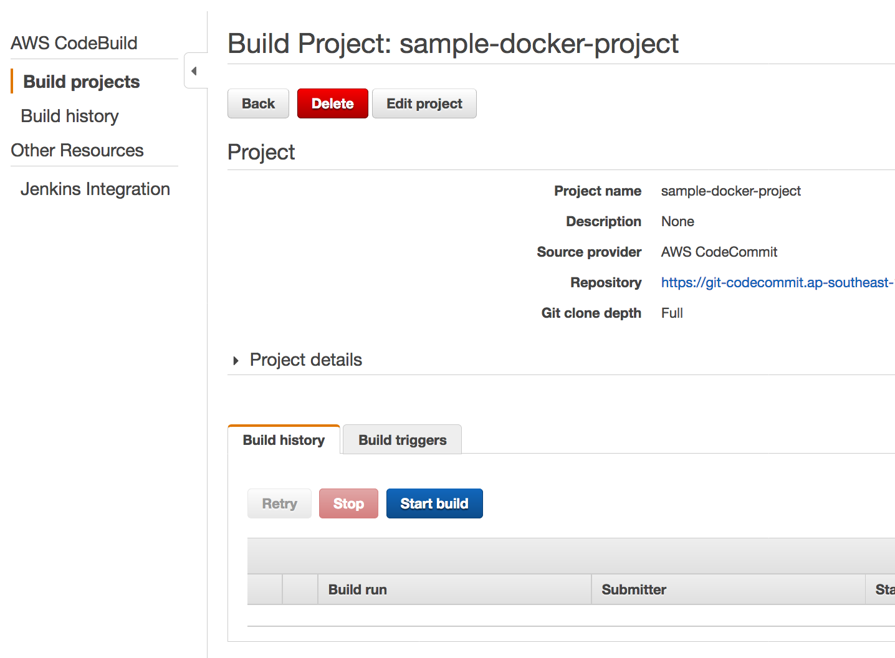

	2. Select master branch

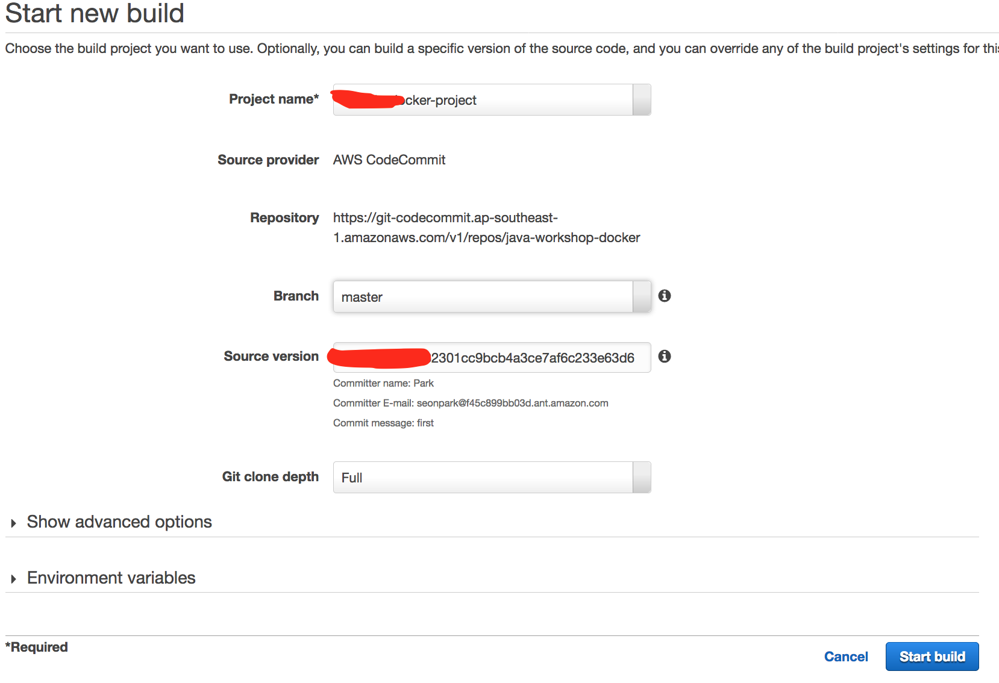
		

#### 2.5. Check Your Roles for CoudeBuild

Check your build result and if your role dosn't have enough privilege then add more access privilege on access policy.

	1. Give a full CloudWatch Write privilege
	2. Give a full ECR privilege


<hr>

#### 2.6. Check pushed image in your local machine

	1. You can describle the iamges withing a repository with following command.

```
aws ecr describe-images --repository-name java-workshop

```

	2. Pull the image using the docker pull

```
docker pull <aws_account_id>.dkr.ecr.<your_region>.amazonaws.com/java-workshop:latest

docker pull 550622896891.dkr.ecr.ap-southeast-1.amazonaws.com/java-workshop:latest

docker images 

docker run -d -p 80:8080 --name=hello-world <IMAGE_ID>

docker run -d -p 80:8080 --name=hello-world 6f9c0d0b1c56

docker ps
```

### 3 Create CICD for docker

https://docs.aws.amazon.com/AmazonECS/latest/developerguide/ecs-cd-pipeline.html

#### 3.1 Create ECS cluster

	1. Create a cluster
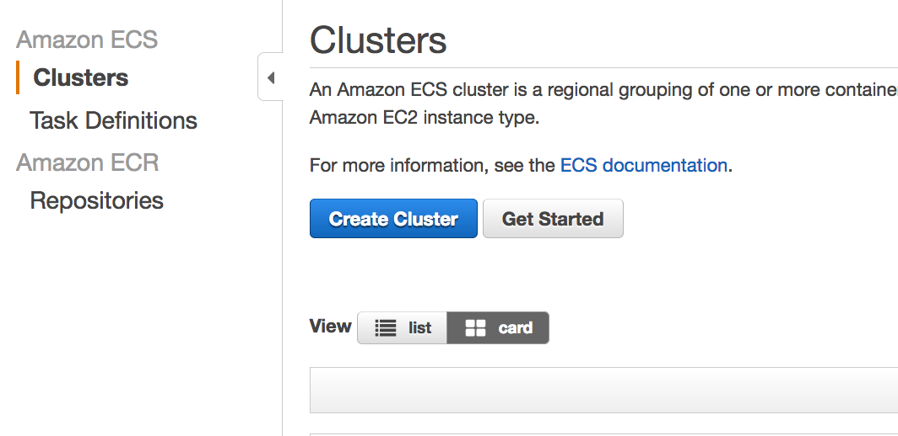 	


	2. Select linux cluster

 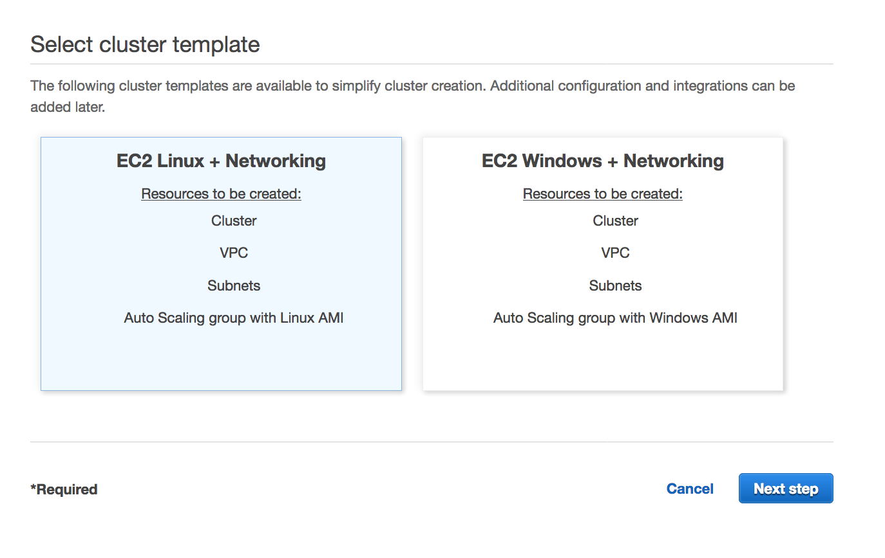 
 
 
	3. Specify Cluster configuration

- Cluster Name 				: Java-cluster
- EC2 instance type 		: m4.xlarge
- Number of instances 	: 1
- Security Group 			: Create a new security Group
- Role									: Select a EC2 instance role to support your Task (need to create a new role)


 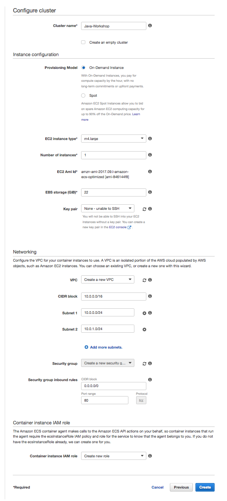 
 
#### 3.2 Create Task definition

	1. Specify information

- Task Definition Name : java-workshop
- Network Mode : Bridge
- Task memory (MiB) : 512
- Task CPU (unit) : 200

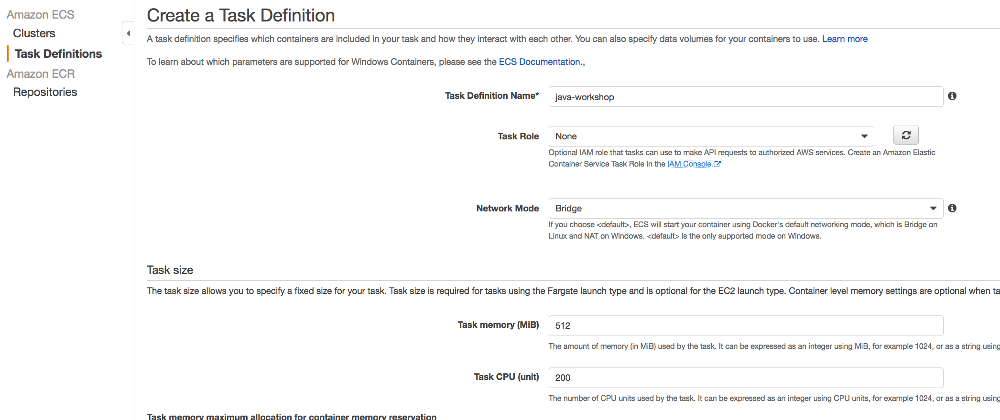 

	2. Specify container information
	
- **Container name** : **java-container**
- **Image** : <YOUR ECR image ARN> (for example, <account-id>.dkr.ecr.ap-southeast-1.amazonaws.com/java-workshop	)
- Memory Limits (MiB) : 128
- Port mapping : 80 : 8080

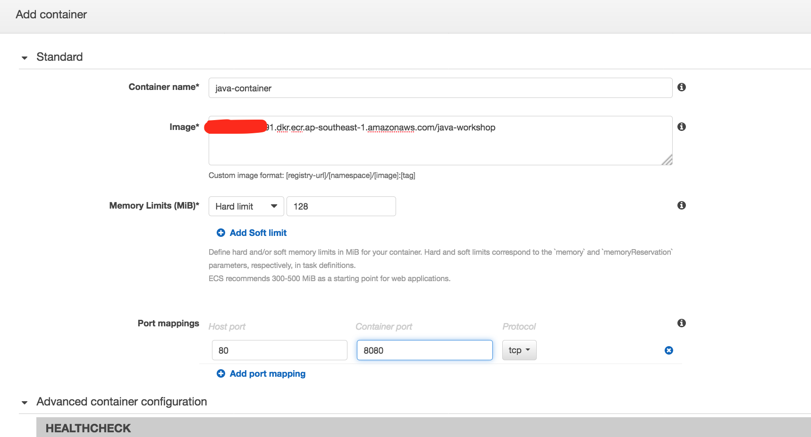 

 
#### 3.3 Create Service definition


	1. Configure service
	
- Task Definition 					: select a task you created in task definition
- Cluster 									: select the cluster (Java-cluster)
- Service name 						: java-service
- Number of tasks 					: 1
- Minimum healthy percent 	: 50
- Maximum percent 					: 200	

- Placement Templates : AZ Balanced spread

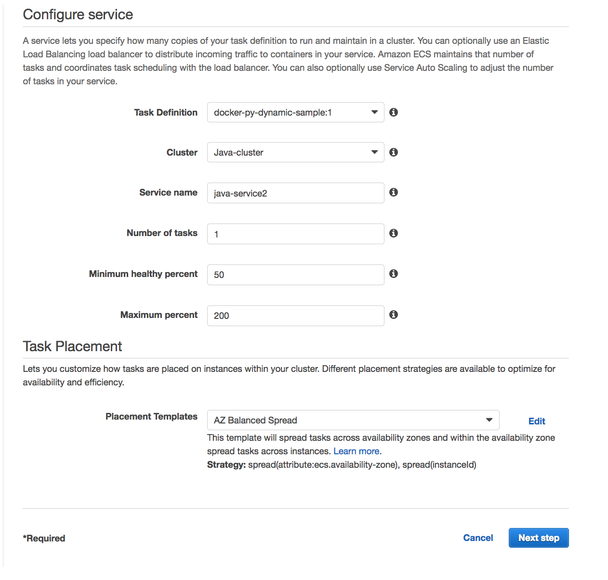 

	2. Configure network
- None load balancer

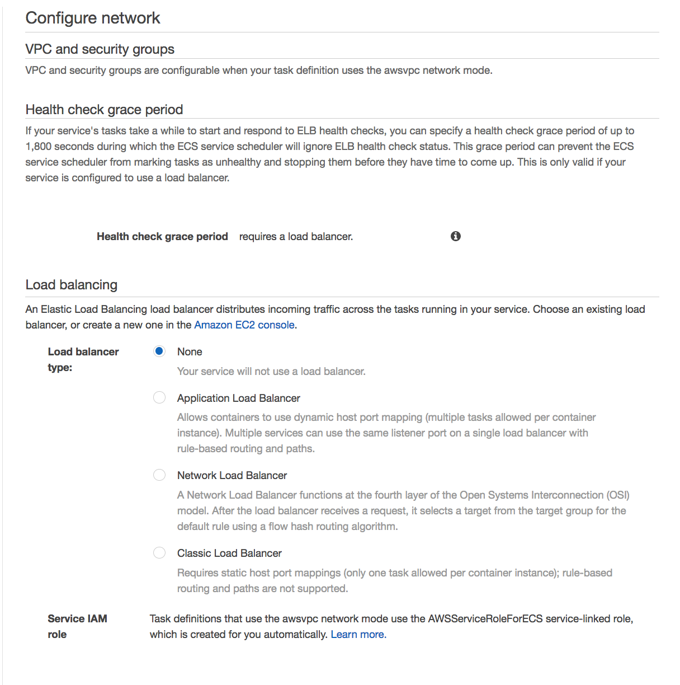
 
  
	3.	Cofigure autoscaling
- None

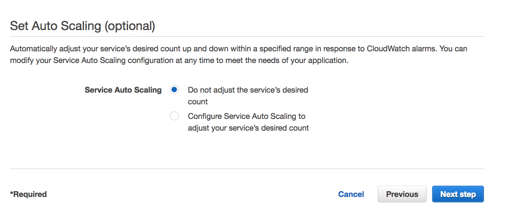
 
 	

#### 3.4 Add imagedefinition.json in your root directory of source codes

- name is the container name you defined in task definition 

```
[
    {
        "name": "java-container",
        "imageUri": "550622896891.dkr.ecr.ap-southeast-1.amazonaws.com/java-workshop"
    }
]

```

### 4. Complete a CI/CD

#### 4.1 Add deploy stage

	1. Add deploy stage in your CI/CD
- Action category: Deploy
- Action name : Specify your service name 
- Deployment provide : Amazon ECS
- Cluster name : Java-cluster (Specify your cluster name you created)
- Service name : java-service (Select service name you created )
- Image filename : imagedefinition.json (The file name you added in previous step)
- Input artifacts : Specify the artifact name of previous stage

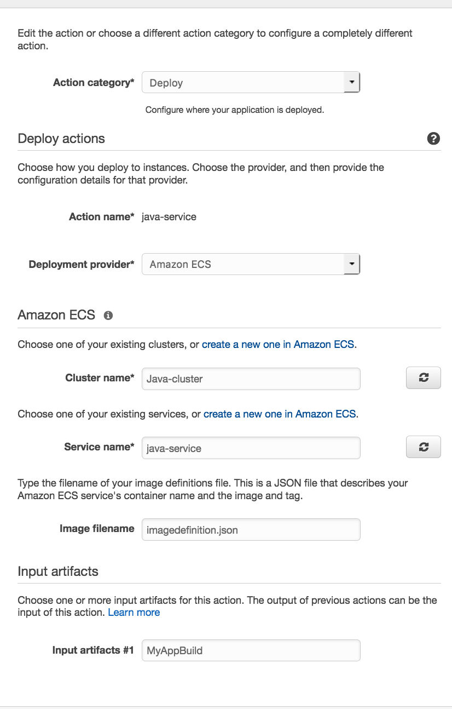


#### 4.2 Deploy your application

	1. change code and deploy it
	
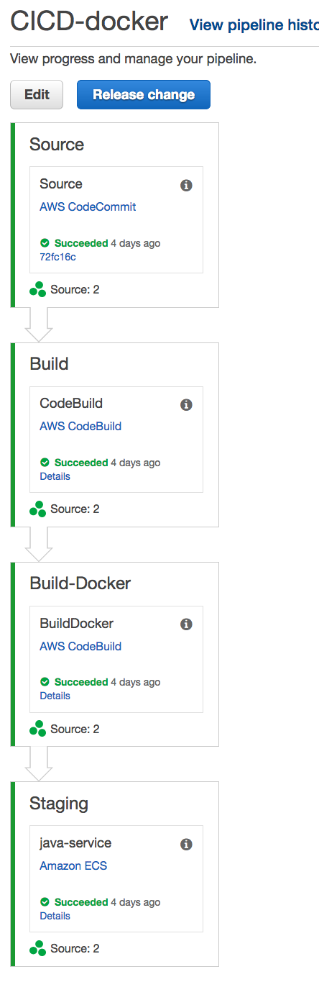	


### Reference : Change a parameter in CodePipeline


- ultiple project in eclipse
http://www.avajava.com/tutorials/lessons/how-do-i-create-a-multi-module-project-in-eclipse.html
		
refer : https://stelligent.com/2017/03/09/using-parameter-store-with-aws-codepipeline/


- check CodePipeline exceution

```
aws codepipeline get-pipeline-execution --pipeline-name CICD-docker --pipeline-execution-id cc0cb5e5-d001-44bc-9e27-3233f1a98323
```

<hr>


