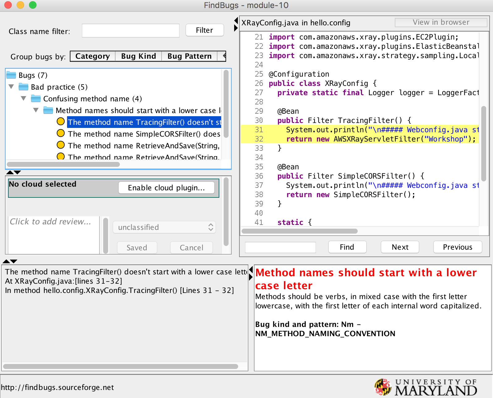

## Module-10 DevSecOps 

- DevOps is a combination of cultural philosophies, practices, and tools that emphasizes collaboration and communication between IT infra team and software developers

- DevSecOps covers security of and in the CI/CD pipeline, including automating security operations and auditing. The goals of DevSecOps are to:

	1. Embed security knowledge into DevOps teams so that they can secure the pipelines they design and automate.
	2. Embed application development knowledge and automated tools and processes into security teams so that they can provide security at scale in the cloud.

- In this module, we will covers a fundamental knowledge and tools for DevSecOps and how to implement in Java project.


### 1. Checking source codes : Applying Git-Secret 

Refer : ** https://github.com/awslabs/git-secrets **

- Prevents you from committing passwords and other sensitive information to a Git repository.

#### 1.1 Install Git-Secrit

```
git clone https://github.com/awslabs/git-secrets
```

You can use install target of the provided Makefile to install git secrets and the man page. You can customize the install path using the PREFIX and MANPREFIX variables.

```
make install
```

Or, installing with Homebrew (for OS X users).

```
brew install git-secrets
```

#### 1.2 Scan 

Scan all files in the repo:

```
git secrets --scan
```

Scans a single file for secrets:

```
git secrets --scan /path/to/file
```

Scans a directory recursively for secrets:

```
git secrets --scan -r /path/to/directory
```

Scans multiple files for secrets:

```
git secrets --scan /path/to/file /path/to/other/file
```

#### 1.3 Test AWS secret 

	1. register AWS secrete into git secrets

```
git secrets --add-provider -- git secrets --aws-provider
```
	2. Add your access key in moudle-04, applicaiton.properties fies
	
```
amazon.dynamodb.endpoint=endpoint
amazon.aws.accesskey=AAAAAXXCXCXCCXCXCX
amazon.aws.secretkey=key2
```

	3. Run a scan

```
git secrets --scan module-04/src/main/resources/application.properties 
module-04/src/main/resources/application.properties:3:amazon.aws.amazon.aws.accesskey=AAAAAXXCXCXCCXCXCX

[ERROR] Matched one or more prohibited patterns
```

#### 1.4 Test a custom pattern
	1. Save a following content as test.txt in your arbitrary directory

```
This is a test!
password=ex@mplepassword
password=******
More test...

```

2. Run following commands

```
git secrets --add 'password\s*=\s*.+'
git secrets --add --allowed --literal 'ex@mplepassword'

git secrets --scan ./text.txt

```

- You can add this step in your build phase


### 2. Checking vulnerabilities of source codes
- It is very crucial step for finding security vulnerabilities in Java programs

#### 2.1 Add FindSecBugs
- A security specific plugin for FingBugs that significantly improves FindBug's ability to find security vulnerabilities in Java programs

- Refer : https://github.com/find-sec-bugs/find-sec-bugs/wiki/Maven-configuration

	1. Add plugin in pom.xml

```
<plugin>
      <groupId>com.github.spotbugs</groupId>
      <artifactId>spotbugs-maven-plugin</artifactId>
      <version>3.1.1</version>
      <configuration>
          <effort>Max</effort>
          <threshold>Low</threshold>
          <failOnError>true</failOnError>
          <includeFilterFile>${session.executionRootDirectory}/spotbugs-security-include.xml</includeFilterFile>
          <excludeFilterFile>${session.executionRootDirectory}/spotbugs-security-exclude.xml</excludeFilterFile>
          <plugins>
              <plugin>
                  <groupId>com.h3xstream.findsecbugs</groupId>
                  <artifactId>findsecbugs-plugin</artifactId>
                  <version>LATEST</version> <!-- Auto-update to the latest stable -->
              </plugin>
          </plugins>
      </configuration>
  </plugin>


```

	2. Specify the filter file limiting the research to security category only.

**/spotbugs-security-include.xml**

```
<FindBugsFilter>
    <Match>
        <Bug category="SECURITY"/>
    </Match>
</FindBugsFilter>

```

**/spotbugs-security-exclude.xml**

```
<FindBugsFilter>
</FindBugsFilter>

```

	3. Doing a scan

```
mvn compile
mvn findbugs:findbugs
```

	4. Analyzing the result

**XML report**

A XML report is generated at target/findbugsXml.xml

**GUI**

```
mvn findbugs:gui
```

  


#### 2.3. Another tools

Visualcodegrepp : https://sourceforge.net/projects/visualcodegrepp/
SearchDiggy :https://www.bishopfox.com/resources/tools/google-hacking-diggity/attack-tools/
Xanitizer : https://www.rigs-it.com/xanitizer/


### 3. Checking vulnerabilities of Infrastructure

#### 3.1 Before creating Infrastructure : CFn_nag 


Refer : 
https://github.com/stelligent/Cfn_nag
https://stelligent.com/2018/03/23/validating-aws-cloudformation-templates-with-cfn_nag-and-mu/

- You need Ruby to run Cfn_nag

	1. Install cfn-nag

```
gem install cfn-nag
```

	2. Run gfn_nag
```
cfn_nag_scan --input-path VPC_2Subnet_2AZ-GameServer_v1.4.template
```

	3. Check the results

```
 WARN W26
|
| Resources: ["ElasticLoadBalancer"]
|
| Elastic Load Balancer should have access logging enabled
------------------------------------------------------------
| FAIL F4
|
| Resources: ["CodeDeployRolePolicies", "InstanceRolePolicies"]
|
| IAM policy should not allow * action

```
	4. Run another
	
```
cfn_nag_scan --input-path lambda-package-example.yaml 

```


#### 3.2 After creating Infrastructure : CloudSploit

Ref : CloudSploit (https://github.com/cloudsploit)

- Capturing things in your account like open security groups, misconfigured VPCs, and more
- You requires node.js

1. Download and install  ColdSploit scan

```
git clone https://github.com/cloudsploit/scans.git
cd scans
npm install
```

2. Set up environment variables

```
export AWS_ACCESS_KEY_ID=AKIAIxxxxxxxxxxxxxxx
export AWS_SECRET_ACCESS_KEY=vJ8CNtxxxxxxxxxxxxxxxxxxxxxxxxxxx
```

3. Run Cloudsploit

```
node index.js
```

4. Check HIPPA compliance

```
node index.js --compliance=hipaa
```

### 4. AWS Config custom rule

- Refer :
https://github.com/awslabs/aws-config-rules

	
### Post-Works
- Try to build your own DevSecOps CI/CD, choose following tasks.

1. CodeBuid 
- Add git-secret
- Add FindSecBugs
- Add Cfn-nag for CloudFormation template (if it is)
 
2. Add AWS Config custom rules

3. After Deployment
- Add CloudSploit after deployment 

4. 

### Reference
- DevSecOps blog : 

	https://aws.amazon.com/blogs/devops/implementing-devsecops-using-aws-codepipeline/
	https://aws.amazon.com/blogs/developer/devops-meets-security-security-testing-your-aws-application-part-i-unit-testing/	
	
- 	FindBugs - Find Bugs (including a few security flaws) in Java programs
- FindSecBugs - A security specific plugin for FingBugs that significantly improves FindBug's ability to find security vulnerabilities in Java programs
- Google CodeSearchDiggity - Uses Google Code Search to identifies vulnerabilities in open source code projects. The tool comes with over 130 default searches that identify SQL injection, cross-site scripting (XSS), insecure remote and local file includes, hard-coded passwords, and much more.

- git-secrets - Prevents you from committing passwords and other sensitive information to a Git repository.
- aws-security-benchmark - Benchmark scripts mapped against trusted security frameworks.
- aws-config-rules - [Node, Python, Java] Repository of sample custom rules for AWS Config
- Netflix/security_monkey - Monitors policy changes and alerts on insecure configurations in an AWS account. 
- Netflix/edda - Edda is a service to track changes in your cloud deployments.
- ThreatResponse - Open Source Security Suite for hardening and responding in AWS.
- CloudSploit – Capturing things like open security groups, misconfigured VPCs, and more.
- Stelligent/Cfn_nag – Looks for patterns in CloudFormation templates that may indicate insecure infrastructure.
- Capitalone/cloud-custodian - Rules engine for AWS fleet management.

